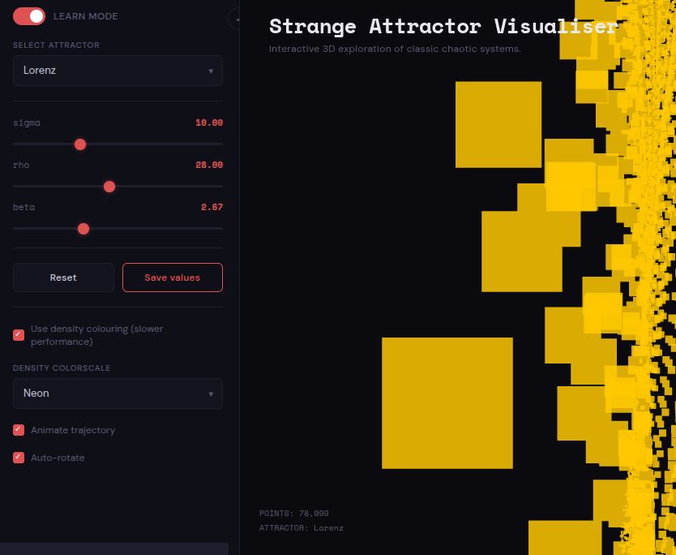
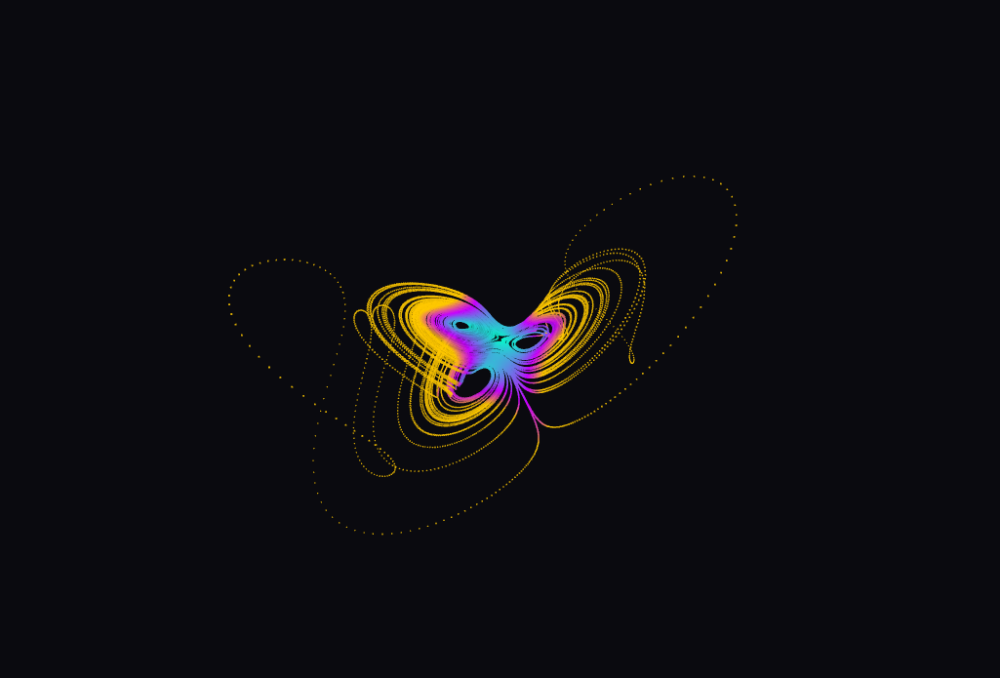
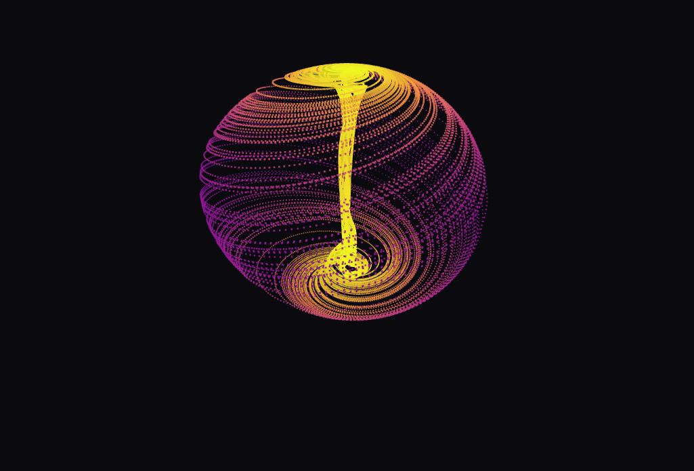

# 🌀 Strange Attractor Visualiser

> Interactive 3D exploration of classic chaotic dynamical systems — built with Three.js, rendered in-browser or via Streamlit.

<!-- ============================================================
  SCREENSHOT 1 — Hero / Overview
  Replace the src below with your actual screenshot path.
  Recommended: full-app screenshot showing the Lorenz attractor
  with the sidebar visible. Size: 1200×675px minimum.
  ============================================================ -->
<!-- 📸 ADD PICTURE HERE (line 14) -->


---

## Table of Contents

- [Demo](#demo)
- [Features](#features)
- [Attractors](#attractors)
- [Getting Started](#getting-started)
- [Usage](#usage)
- [File Structure](#file-structure)
- [How It Works](#how-it-works)
- [Performance Notes](#performance-notes)
- [License](#license)

---

## Demo

Two ways to run — no build step required for either.

**Standalone HTML** (fastest, zero dependencies):
```bash
# Just open the file directly in any modern browser
open strange_attractor.html        # macOS
xdg-open strange_attractor.html    # Linux
start strange_attractor.html       # Windows
```

**Streamlit app** (if you want it embedded in a Python web app):
```bash
pip install -r requirements.txt
streamlit run app.py
```
Then visit `http://localhost:8501`.

---

## Features

<!-- ============================================================
  SCREENSHOT 2 — Sidebar / Controls Panel
  Capture just the left sidebar with sliders visible.
  Recommended: 400×600px, showing param sliders clearly.
  ============================================================ -->
<!-- 📸 ADD PICTURE HERE (line 57) -->


| Feature | Description |
|---|---|
| **6 Strange Attractors** | Lorenz, Rössler, Dadras, Aizawa, Halvorsen, Chen |
| **Live Parameter Sliders** | Each attractor exposes its own ODE parameters; trajectory recomputes on every change |
| **Velocity Coloring** | Default fast coloring based on local trajectory speed |
| **Density Coloring** | Heatmap based on local point density — toggle on/off |
| **5 Color Scales** | Blue→White, Heat, Plasma, Viridis, Neon |
| **3D Orbit Controls** | Click-drag to rotate, scroll to zoom, touch supported |
| **Auto-Rotate** | Continuous slow rotation toggle |
| **Animate Trajectory** | Watch the attractor draw itself point-by-point |
| **Learn Mode** | Floating panel with description + differential equations |
| **Screenshot Export** | One-click PNG download of the current view |
| **Collapsible Sidebar** | Maximize canvas space when needed |
| **Save Values** | Persist custom parameter values per attractor within session |

---

## Attractors

### Lorenz

<!-- ============================================================
  SCREENSHOT 3 — Lorenz Attractor
  The classic butterfly. Use default params (σ=10, ρ=28, β=2.667).
  Recommended: canvas-only crop, 800×600px.
  ============================================================ -->
<!-- 📸 ADD PICTURE HERE (line 83) -->


Discovered by Edward Lorenz in 1963 while modelling atmospheric convection. The iconic butterfly shape became the symbol of chaos theory. Sensitive to initial conditions — the origin of the term *butterfly effect*.

```
dx/dt = σ(y − x)
dy/dt = x(ρ − z) − y
dz/dt = xy − βz

Default: σ=10, ρ=28, β=2.667
```

---

### Rössler

<!-- ============================================================
  SCREENSHOT 4 — Rössler Attractor
  Single spiral lobe. Use default params (a=0.2, b=0.2, c=5.7).
  Recommended: canvas-only crop, 800×600px.
  ============================================================ -->
<!-- 📸 ADD PICTURE HERE (line 101) -->


Proposed by Otto Rössler in 1976 as the simplest possible strange attractor. One spiral lobe, used extensively to study period-doubling routes to chaos.

```
dx/dt = −y − z
dy/dt = x + ay
dz/dt = b + z(x − c)

Default: a=0.2, b=0.2, c=5.7
```

---

### Dadras

<!-- ============================================================
  SCREENSHOT 5 — Dadras Attractor
  Double-winged form. Use default params (a=3, b=2.7, c=1.7, d=2, e=9).
  Recommended: canvas-only crop, 800×600px.
  ============================================================ -->
<!-- 📸 ADD PICTURE HERE (line 119) -->


A 5-parameter system producing a striking double-winged form. Named after Sara Dadras. Exhibits rich bifurcation behaviour across its parameter space.

```
dx/dt = y − ax + byz
dy/dt = cy − xz + z
dz/dt = dxy − ez

Default: a=3, b=2.7, c=1.7, d=2, e=9
```

---

### Aizawa

<!-- ============================================================
  SCREENSHOT 6 — Aizawa Attractor
  Toroidal/donut shape. Use default params.
  Recommended: canvas-only crop, 800×600px.
  ============================================================ -->
<!-- 📸 ADD PICTURE HERE (line 137) -->


Creates a toroidal (donut-shaped) structure — a rare geometry among strange attractors. Six parameters allow fine control over the torus shape and chaos intensity.

```
dx/dt = (z−b)x − dy
dy/dt = dx + (z−b)y
dz/dt = c + az − z³/3 − (x²+y²)(1+ez) + fzx³

Default: a=0.95, b=0.7, c=0.6, d=3.5, e=0.25, f=0.1
```

---

### Halvorsen

<!-- ============================================================
  SCREENSHOT 7 — Halvorsen Attractor
  Trefoil/3-fold symmetry. Use default param a=1.4.
  Recommended: canvas-only crop, 800×600px.
  ============================================================ -->
<!-- 📸 ADD PICTURE HERE (line 155) -->


Three-fold rotational symmetry — all three equations are cyclic permutations of each other. Produces a distinctive trefoil-like form.

```
dx/dt = −ax − 4y − 4z − y²
dy/dt = −ay − 4z − 4x − z²
dz/dt = −az − 4x − 4y − x²

Default: a=1.4
```

---

### Chen

<!-- ============================================================
  SCREENSHOT 8 — Chen Attractor
  Double-scroll butterfly. Use default params (a=35, b=3, c=28).
  Recommended: canvas-only crop, 800×600px.
  ============================================================ -->
<!-- 📸 ADD PICTURE HERE (line 173) -->


Discovered by Guanrong Chen in 1999. A sibling to Lorenz but topologically inequivalent. Produces a double-scroll butterfly with fundamentally different dynamics.

```
dx/dt = a(y − x)
dy/dt = (c−a)x − xz + cy
dz/dt = xy − bz

Default: a=35, b=3, c=28
```

---

## Getting Started

### Requirements

- Any modern browser (Chrome, Firefox, Safari, Edge) for the standalone HTML
- Python 3.8+ and pip only if using the Streamlit wrapper

### Installation

```bash
# Clone or download the project
git clone https://github.com/yourusername/strange-attractor-visualiser.git
cd strange-attractor-visualiser

# Option A: open directly (no install needed)
open strange_attractor.html

# Option B: Streamlit
pip install -r requirements.txt
streamlit run app.py
```

### File Structure

```
strange-attractor-visualiser/
├── strange_attractor.html   # Self-contained visualiser (Three.js via CDN)
├── app.py                   # Streamlit wrapper
├── requirements.txt         # Python deps (just streamlit)
├── README.md
└── screenshots/            
    ├── overview.png
    ├── sidebar_controls.png
    ├── lorenz.png
    ├── rossler.png
    ├── dadras.png
    ├── aizawa.png
    ├── halvorsen.png
    └── chen.png
```

---

## Usage

### Controls

| Action | How |
|---|---|
| **Rotate** | Click and drag on the canvas |
| **Zoom** | Scroll wheel |
| **Touch rotate** | Single-finger drag |
| **Change attractor** | Dropdown in sidebar |
| **Tune parameters** | Sliders — trajectory recomputes live |
| **Reset params** | Reset button |
| **Save params** | Save values button (persists per session) |
| **Density coloring** | Checkbox — slower but shows point density |
| **Change color scheme** | Density colorscale dropdown |
| **Animate** | Check "Animate trajectory" to watch it draw |
| **Auto-rotate** | Toggle continuous rotation |
| **Screenshot** | Click the ⬛ icon top-right |
| **Learn mode** | Toggle at top of sidebar |
| **Collapse sidebar** | Click the ◀ / ▶ button |

### Learn Mode

<!-- ============================================================
  SCREENSHOT 9 — Learn Mode Panel
  Show the floating panel bottom-right with equations visible.
  Recommended: 800×600px, panel clearly readable.
  ============================================================ -->
<!-- 📸 ADD PICTURE HERE (line 243) -->


Toggle "Learn mode" in the sidebar to show a floating panel with a description of the current attractor and its differential equations.

### Density Coloring

<!-- ============================================================
  SCREENSHOT 10 — Density Coloring comparison
  Side-by-side or just the density-colored version.
  Plasma or Heat colorscale looks best for this screenshot.
  Recommended: 800×600px.
  ============================================================ -->
<!-- 📸 ADD PICTURE HERE (line 256) -->


When density coloring is enabled, each point's color reflects how many other points are nearby in 3D space. Dense regions (where the trajectory lingers) appear brighter. This is a local-window heuristic (K=50 neighbors), not a full KDE — fast enough for real-time use.

---

## How It Works

The visualiser integrates each ODE system using **Euler's method** with a small fixed timestep (`dt` varies per attractor, typically 0.002–0.01). The first 1000 steps are discarded as transient warmup before the trajectory settles onto the attractor.

```
For each step:
  [dx, dy, dz] = f(x, y, z, params)
  x += dx * dt
  y += dy * dt
  z += dz * dt
```

The resulting 60,000–80,000 points are uploaded to GPU memory as a Three.js `BufferGeometry` with `PointsMaterial`. Color is computed CPU-side (velocity or density) and passed as a `color` attribute.

Rotation uses a manual spherical coordinate system — no OrbitControls dependency needed.

---

## Performance Notes

| Mode | Points | Approx. Recompute Time |
|---|---|---|
| Velocity coloring | 60–80k | ~20–80ms |
| Density coloring | 60–80k | ~200–800ms |
| Animate trajectory | Incremental | Smooth, 500pts/frame |

Density coloring runs on the main thread. On lower-end hardware it may cause a brief freeze on recompute — this is expected. A future version could offload this to a Web Worker.

---

## Tech Stack

- **Three.js r128** — WebGL rendering via CDN, no bundler needed
- **Euler integration** — simple but sufficient for visualization at these step sizes
- **Streamlit ≥ 1.32** — HTML component embedding via `components.html()`
- **Space Mono + DM Sans** — Google Fonts, loaded via `@import`

---

## License

MIT — do whatever you want with it.

---

> *"Chaos is not disorder — it is order beyond our ability to see."* 
> *© Jaishak J*
